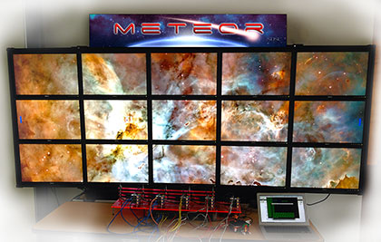
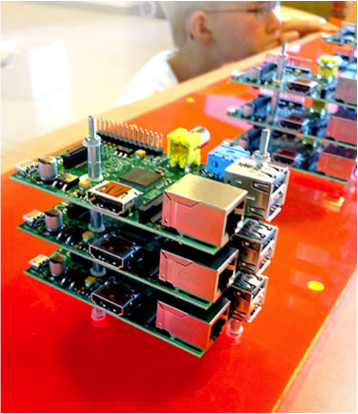

# SDSC Sandbox Raspberry Pi Cluster Guide

This is a guide to building Linux clusters for [Raspberry Pis](https://www.raspberrypi.org/). In the
workshop directory you'll find some background information on Linux
clusters and parallel computing along with the step-by-step
instructions on how to create a Raspberry Pi cluster. The config
directory has a script and configuration files that to help set up
the cluster. And the examples directory contains a growing number of
parallel applications for trying out and hacking.

This guide comes out of our experience with
[Meteor](http://cacm.acm.org/careers/169669-sdsc-uses-raspberry-pi-cluster-to-teach-parallel-computing/fulltext), a
Raspberry Pi cluster driving a display wall with 15 Raspberry
Pi. We've used that to create video games for fun at several
[SC Conferences](http://supercomputing.org/) and [teach high school and
college students how to do parallel and distributed computing](https://www.nsf.gov/cise/csbytes/newsletter/vol3/pdf/csbb-vol3-i1.pdf). Coupling
the LCD panels to the Raspberry Pis makes a huge difference in helping
people new to parallel computing get a handle on "what's running
where". It also makes for a very engaging environment. You don't need
to do this for your cluster but if you want to this will help you
start.

Please contribute via issues or a pull request!

## Concept & Motivation

Right now, there are few courses on parallel programming even at the
undergraduate level, but the basic concepts aren't difficult. We want
to get those concepts out to students in an accessible way by helping
people build and use small supercomputers. This guide shows you how to put
together a Linux cluster using 2-4 Raspberry Pis, including hardware
assembly, networking, and running parallel applications. The cluster will be
a working model of a supercomputer and able to run the same parallel
applications (at a smaller scale).

For the last few years, we have worked with
undergraduates at the [University of California, San Diego](http://ucsd.edu/) introducing
them to parallel and distributed computing using Raspberry Pis . This
experience is easily adaptable to the high school setting, so long as
the students have some help getting over the technical hurdles, like
network configuration and setting up an environment to run libraries
such as the [Message Passing Interface](https://en.wikipedia.org/wiki/Message_Passing_Interface). From there, students can learn
to build networked applications like chat clients, model a 3-tier
client-logic-storage web architecture, or run fluid dynamics
simulations. The purpose of the workshop content is to show the
teachers or independent students how to set up the cluster, and then
spend some time running parallel applications.

## Topics

 * The importance of parallel programming and high performance computing (e.g., the [National Strategic Computing Initiative](https://www.whitehouse.gov/the-press-office/2015/07/29/executive-order-creating-national-strategic-computing-initiative))
 * Introduction to parallel programming in research: models and tools
 * What is a Linux cluster?
 * An overview of the Raspberry Pi, the project, the hardware, and the community
 * Basic network configuration
 * Using SSH
 * Running parallel applications using MPI
 * How to architect a simple distributed graphics application

## Relevance

On their own, Raspberry Pis are a great resource for many types of
classes. They can be used for programming, robotics, or
electronics. The Pis low cost and small size also make them more
accessible for many students. Beyond this, creating a cluster of
Raspberry Pis opens up a new area, one where students begin to think
about how to take advantage of multiple threads of execution on
separate processors, or to break up the workload onto several
computers. This is what professionals at the technology giants
([Google](https://www.google.com/about/careers/), [Microsoft](https://careers.microsoft.com/), [Amazon](https://www.amazon.jobs/), etc.) are doing all the time, along with
scientists modeling earthquakes or stars.

## Licence

Unless otherwise specified, everything in this repository is covered by the following licence:

***SDSC Sandbox Raspberry Pi Cluster Guide*** by the
   [San Diego Supercomputer Center](http://www.sdsc.edu/) is licenced under a [Creative Commons Attribution 4.0 International License](http://creativecommons.org/licenses/by-sa/4.0/).

Based on a work at https://github.com/sdsc/sandbox-cluster-guide

