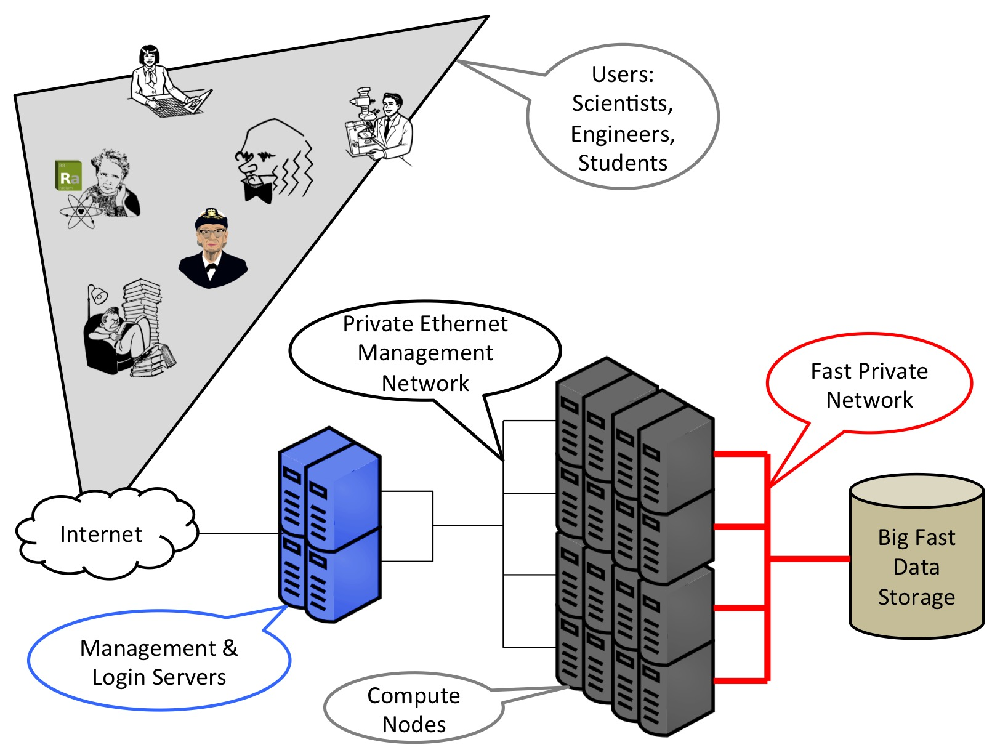
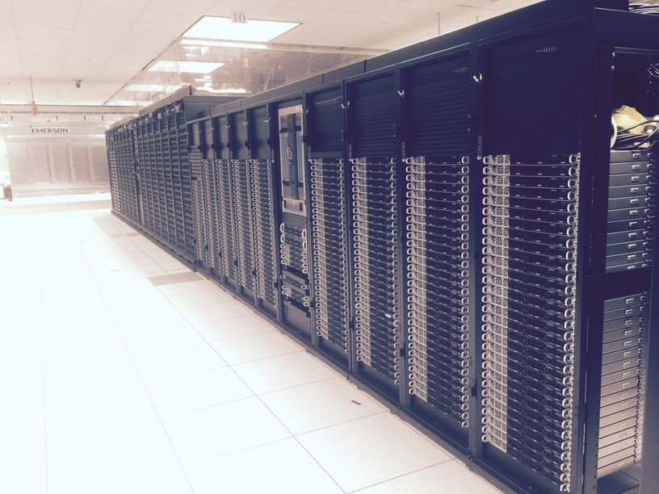
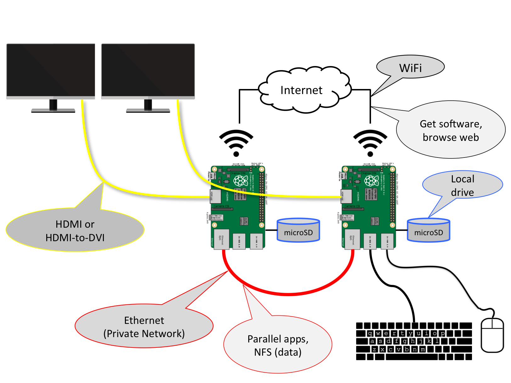

# Linux Clusters

Supercomputers, Linux clusters, and other high-performance computing (HPC) systems have similar architectures and goals. They combine large number of compute nodes (servers) to help scientists, engineers, and others solve problems that are too big or complicated for laptops and desktops. These clusters use fast network to allow the compute nodes to work together synchronously, hence the term supercomputer. They also have large pools of storage (at the scale of [petabytes](https://en.wikipedia.org/wiki/Petabyte)) where the users store their data.

The term "Linux cluster" comes from the fact that most supercomputer use the [Linux](https://kernel.org/) kernel as part of their operating system. This can be seen on the list of the [TOP500](https://www.top500.org/) HPC systems that reported their peak performance in June 2016, where 497 out of 500 used Linux.

While the basic architecture of these clusters is similar the details can be very different. Every cluster is managed a little differently to meet the specialized needs of its community of users. Cluster also evolve with technology changes around processors, networking, and memory. New tools like [fast array computing on GPUs](http://www.nvidia.com/object/what-is-gpu-computing.html) is the kind of advance that has driven changes in only few years. A few years is long time when a typical supercomputer is only around for four or five years. Below is a picture of [SDSC](http://www.sdsc.edu/)'s [Comet](http://www.sdsc.edu/support/user_guides/comet.html) supercomputer beside a predecessor,  [Trestles](http://ucsdnews.ucsd.edu/pressrelease/university_of_arkansas_acquires_sdscs_trestles_supercomputer), as the older system was decommissioned. 

Working on Linux clusters requires understanding the latest technology and understanding how many components of a complex system interact. Most staff in HPC have degrees in a science domain (e.g., physics or chemistry), engineering, or computer science, with many of them having advanced degrees like master's or doctorates. Even with this advanced knowledge the HPC engineers also need to be able to work hands-on with the compute nodes, network, and storage.

[Lawrence Livermore National Laboratory](https://www.llnl.gov/) has a [detailed tutorial](https://computing.llnl.gov/tutorials/linux_clusters/) with more background on Linux clusters.

## Our Raspberry Pi Cluster

For our cluster, we're going to take the basic Linux cluster model and scale it down to a couple of Raspberry Pis. Since the Raspberry Pis use a Linux distribution called [Raspbian](https://www.raspbian.org/), many of the tools and applications that are used on the big supercomputers will run on the Raspberry Pis. Even better, we can attach monitors to our compute nodes (the Pis) and see what they're doing. We'll use the WiFi to download and install applications and the Ethernet ports for our private network. That private network will be more reliable and faster than the WiFi so it's the right choice for our parallel applications to communicate over and sharing data between the Pis. (This is described more in the [networking](networking.md) section.)

## Next

[Assembly](assembly.md)

## Previous

[Inventory](inventory.md)

## Agenda

[Agenda](agenda.md)

[Raspberry Pi diagram](https://commons.wikimedia.org/wiki/File:Raspberry_Pi_B%2B_rev_1.2.svg)
copyright [Wikimedia user Efa2](https://commons.wikimedia.org/w/index.php?title=User:Efa2)/[Wikimedia Commons](http://commons.wikimedia.org/)/[CC BY-SA 4.0](https://creativecommons.org/licenses/by-sa/4.0/)

[Picture of Raspberry Pi 3](https://commons.wikimedia.org/wiki/File:Raspberry_Pi_3_Model_B.png)
copyright [Wikimedia user Herbfargus](https://commons.wikimedia.org/w/index.php?title=User:Herbfargus)/[Wikimedia Commons](http://commons.wikimedia.org/)/[CC BY-SA 4.0](https://creativecommons.org/licenses/by-sa/4.0/)
